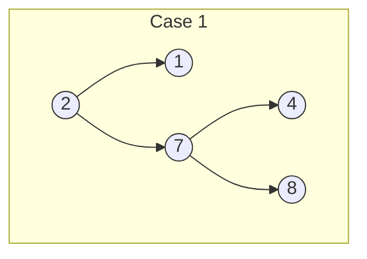

# Dictionary-Implementation-BST-

An implementation of a dictionary as a Binary Search Tree in C++.

#### Removal

Removal involves three different cases

They are illustrated in the graph below.

```mermaid
graph TD;
    subgraph Case 1
    2((2)):::node -->1((1));
    2((2))-->7((7));
    
    
    7((7))-->4((4));
    7((7))-->8((8));
    
    
    classDef node stroke:#333;
    end
```
