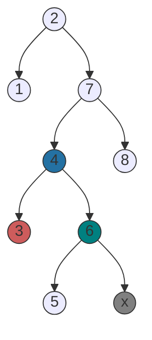
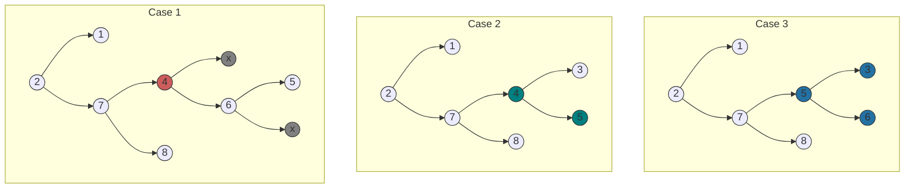

# Dictionary Implementation BST

This program implements a dictionary data structure using a BST. The dictionary stores key-value pairs and allows for efficient search, insert, and delete operations. Please note that this BST implementation is not self-balancing. As a result, the performance of the dictionary may degrade if the BST becomes heavily unbalanced.

Here is a list of operations this Dictionary can call.

- Insert
- Search
- Remove
- InOrderTraversal
- getRoot

## Removal of an item

Removal involves three different cases, and they are illustrated in the graphs below. I first show the initial state of the graph, and then I explain the different cases with the corresponding graphs accompanying the explanations.

Let's learn the differences between nodes.

Let's observe the initial state of the graph below, and then explain the necessary actions depending on each case. Something to note: if the "node" contains x, that means it doesn't exist. The parent points to a nullptr. This is a limitation of my graphing skills using mermaid. In the example below, node 6 has the left child 5 and it does not have a right child, hence the x.

#### Case 1: A leaf node

For the first case, let's say we wanted to remove a **leaf node**. I'm going to choose to remove node 3, which is a left child of node 4. As you may already see, all I need to do is find the parent of the leaf node, and remove its left child. This is the simplest removal process as it just involves removing the left link from the parent and deleting the allocated memory for node 3. Depending on what programming environment you use, you may not have to free the memory manually.

#### Case 2: Node with 1 child

For the second case, we are removing a **node with one child**. In this case, we find the parent of the node to be removed, and we replace the left or right child node of the parent with the child of the node that we want to remove. For example, if we wanted to remove 6 from the graph illustrated above, we first would find its parent. The parent of node 6 is node 4, so we would replace its right child with the left child of node 6 in our graph. It is also important to remember to free the memory that was allocated for the deleted node.

#### Case 3: Node with 2 children

For our third case, we are going to remove a **node with two children**. This case involves finding the succssor of our node that is going to be removed, and relabel the node with said successor. The successor is pretty much the next element that comes after the one we have targeted. For example, in a list of numbers, [...,3,4,5,6] the succesor of number 4 would be number 5 because that's what succeeds it. After we have successfully implemented an algorithm to find the successor, we can then make the appropriate connections to relabel the node.

Here's the resulting graph for each case. Reading the explanations have always been harder for me, so I hope looking at the visual representation will make it easier.

#### The Successor of a Node

Many people think that the successor of a node is simply the left child of the right child of the node. However, this is not true, and I will demonstrate it via the graph below. The simple idea of a successor is that it follows the current value, as in it comes immediately after it. In the graph below, 12 appears after 10, but it is not the next value in sequence. If 10 were replaced with 12, the binary search tree would no longer be valid.

The successor is the node with the smallest value in the right subtree of the target node. In other words, the successor is the leftmost element in the right subtre of the target node. In our case, that would be the node with the value 11.

