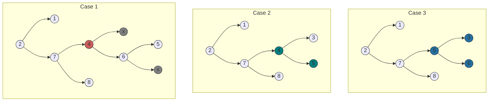

# Dictionary Implementation BST

This program implements a dictionary data structure using a BST. The dictionary stores key-value pairs and allows for efficient search, insert, and delete operations. Please note that this BST implementation is not self-balancing. As a result, the performance of the dictionary may degrade if the BST becomes heavily unbalanced.

Here is a list of operations this Dictionary can call.

- Insert
- Search
- Remove
- InOrderTraversal
- getRoot

### Removal of an item

There are three cases to consider when removing nodes from a graph, as depicted in the accompanying graphs. Firstly, let's review the initial state of the graph. Before we delve into the specifics of each case, it's important to understand the concept of a **successor** node. This function is necessary for the third type of removal we will discuss.

#### The Successor of a Node

Many people think that the successor of a node is simply the left child of the right child of the node. However, this is not true, and I will demonstrate it via the graph below. The simple idea of a successor is that it follows the current value, as in it comes immediately after it. In the graph below, 12 appears after 10, but it is not the next value in sequence. If 10 were replaced with 12, the binary search tree would no longer be valid.

<p align="center">
  <picture>
    <source media="(prefers-color-scheme: light)" srcset="/src/imgs/notthesuccessor.png">
    <source media="(prefers-color-scheme: dark)" srcset="/src/imgs/notthesuccessorDarkMode.png">
    
  </picture>
</p>

The successor is the node with the smallest value in the right subtree of the target node. In other words, the successor is the leftmost element in the right subtre of the target node. In our case, that would be the node with the value 11.

<p align="center">
  <picture>
    <source media="(prefers-color-scheme: light)" srcset="/src/imgs/thesuccessor.png">
    <source media="(prefers-color-scheme: dark)" srcset="/src/imgs/thesuccessorDarkMode.png">
    
  </picture>
</p>

In addition to the **successor** function, there is also a **predecessor** function. Although we will not be using it in our implementation, it serves a similar purpose by identifying the node preceding the target node.

Now, let's examine the three cases of removal in detail.

<picture>
  <source media="(prefers-color-scheme: light)" srcset="/src/imgs/nodetypes.png">
  <source media="(prefers-color-scheme: dark)" srcset="/src/imgs/nodetypesDarkMode.png">
  
</picture>

Let's observe the initial state of the graph below, and then explain the necessary actions depending on each case. Something to note: if the "node" contains x, that means it doesn't exist. The parent points to a nullptr. This is a limitation of my graphing skills using mermaid. In the example below, node 6 has the left child 5 and it does not have a right child, hence the x.

<picture>
  <source media="(prefers-color-scheme: light)" srcset="/src/imgs/initialgraph.png">
  <source media="(prefers-color-scheme: dark)" srcset="/src/imgs/initialgraphDarkMode.png">
  
</picture>

#### Case 1: A leaf node

For the first case, let's say we wanted to remove a **leaf node**. I'm going to choose to remove node 8, which is a left child of node 10. As you may already see, all I need to do is find the parent of the leaf node, and remove its left child. This is the simplest removal process as it just involves removing the left or right link from the parent and deleting the allocated memory for the node. Depending on what programming environment you use, you may not have to free the memory manually.

<picture>
  <source media="(prefers-color-scheme: light)" srcset="/src/imgs/leafnoderemovalDarkMode.png">
  <source media="(prefers-color-scheme: dark)" srcset="/src/imgs/leafnoderemovalDarkMode.png">
  
</picture>

#### Case 2: Node with 1 child

For the second case, we are removing a **node with one child**. In this case, we find the parent of the node to be removed, and we replace the left or right child node of the parent with the child of the node that we want to remove. For example, if we wanted to remove 4 from the graph illustrated above, we first would find its parent. Node 4 is a left child of node 5, so we would replace the left child of node 5 with the left child of node 4 in our graph. It is also important to remember to free the memory that was allocated for the deleted node if possible.

#### Case 3: Node with 2 children

In this case, we will be removing a node from a binary search tree that has two children. To do this, we will first need to find the successor of the node that we want to remove. The successor is the next element in the tree after the node we are targeting. For example, in a list of numbers, if we want to remove the node containing the number 10, the successor would be the node containing the number 11 because it comes immediately after 10 in the tree. Once we have identified the successor, we will copy its data and use the remove function to remove it from its current position in the tree. Finally, we will replace the node that we originally targeted with the data from the successor. This will complete the removal process.

Here's the code snippet for the third case.

```cpp
else {
  Node *successor = foundNode->right;

  while (successor->left != nullptr) {
      successor = successor->left;
  }

  std::string successorWord = successor->word;
  std::string successorMeaning = successor->meaning;

  remove(successor->word);

  foundNode->word = successorWord;
  foundNode->meaning = successorWord;
  return true;
}
```

Here's the resulting graph for each case. Reading the explanations have always been harder for me, so I hope looking at the visual representation will make it easier.


